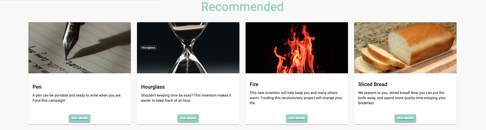
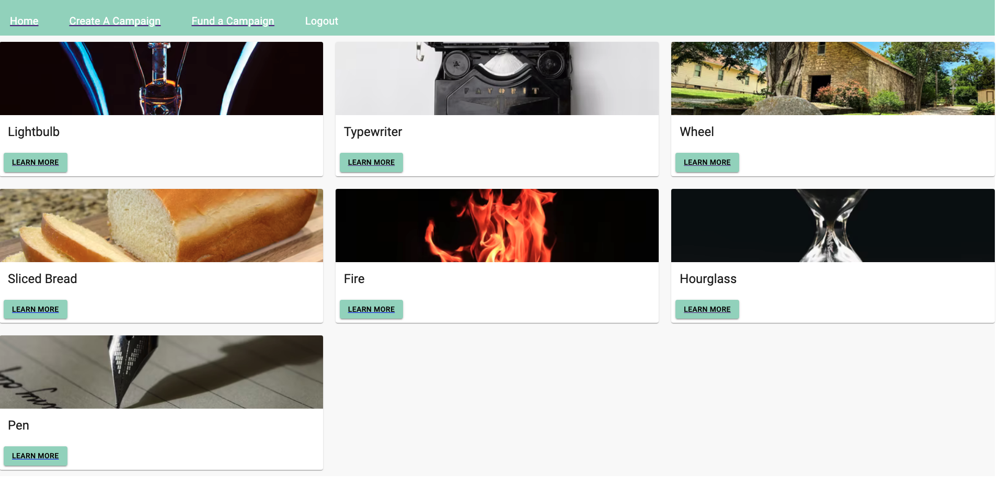
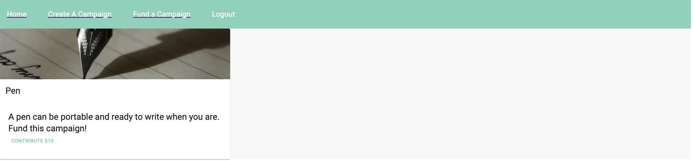
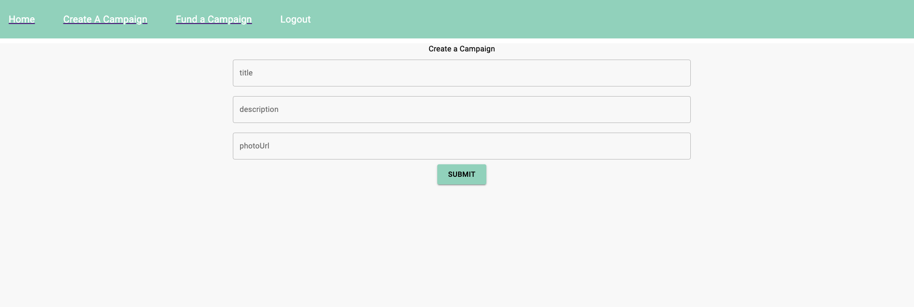
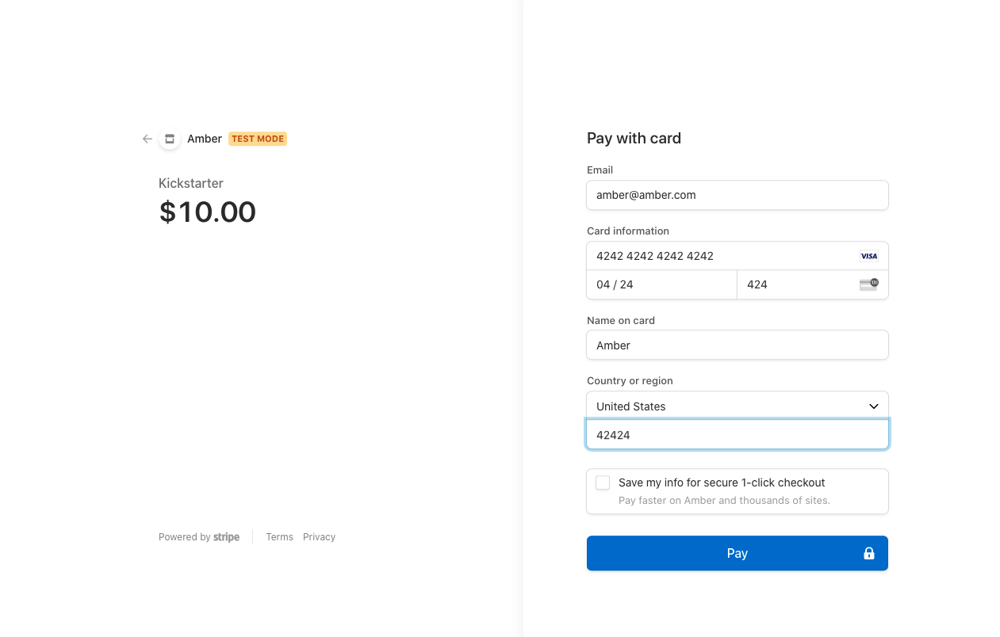
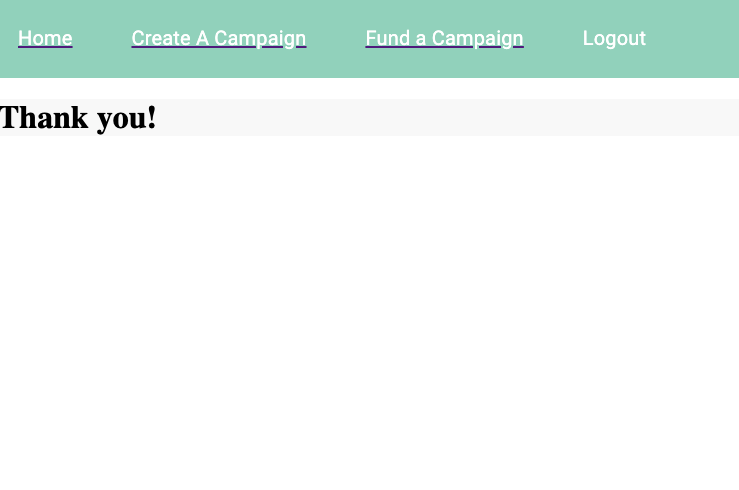

# AchievIt

## Tech Stack:

# Frontend:

Typescript & React.js, Stripe

# Backend:

Node.js, PostgreSQL, Prisma, Stripe

This app allows users to create campaigns, as well as browse through other campaigns and donate in $10 amounts to the kickstarters of their choosing.

There are two models: Users and Campaigns. Users can have many Campaigns.

After choosing a campaign to fund, the Stripe prompts a payment page where users can enter their payment information. To test this out use fill all fields that require numbers with '42's.

Users can also update and delete fundraising campaigns that they own.

The architectural pattern used here was MVC. The implementation can be seen where only particular components are in charge of fetching data from a server. For example, the Home component is solely in charge of displaying the UI components, while other components such as Profile, Recommended, and SingleCampaign are charged with the task of fetching the data.

Material UI was used for styling. The components used were: Button, TextField, Typography, Card, and Grid.

A component I made reusable was the 'SingleCampaign' component which is featured in 'Campaigns', 'Profile', and in the Home Page.

# To Install:

Fork and clone the repo.
npm install
cd client, npm install
cd ..
npm run dev

expected payload for a typical get route (ex: /campaigns) is an object with all of the seeded and data created by users.

# User Flow:

Home:

View the deployed application [here](https://amber-kickstarter.herokuapp.com/)
